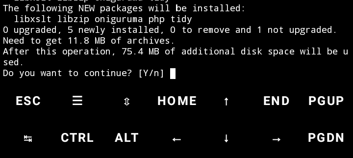

# Bot WhatsApp pakai fitur Ai yang kompatibel di termux😊
Bot ini dilengkapi fitur scan barcode dan fairing jadi bisa pilih opsi mana apalagi bot ini dibuat 2025 jadi nggak perlu fix fairing dulu
<div align="center">
  <p>
    
    </p>
  

[](https://chat.whatsapp.com/Jmbs0K52j3fB4FOP5wViWX)

# grup WhatsApp


Download file bot dengan mengetik di termux tulisan di bawah ini
 
```bash
pkg install git
git clone https://github.com/Rizky598/WABOT.git
cd WABOT
tar -xvzf archive-2025-06-26T065303Z.tar.gz
cd extracted_folder/
chmod +x install-bot.sh
sh install-bot.sh
```
Untuk menghapus folder bernama session di Termux kamu bisa gunakan perintah berikut😊

```bash
rm -rf session
```
# tutorial

Kalau muncul tulisan seperti ini, tekan saja Y. Lakukan ini setiap proses berhenti. Setelah masuk ke menu utama (pilihan QR dan pairing), pastikan semua tulisan diketik dengan huruf kecil
<div align="center">
  <p>
    
    </p>
"BTW, setelah bot aktif di WhatsApp, semua perintah harus diketik dengan huruf kecil. Misalnya, ketik menu, bukan Menu atau MENU"